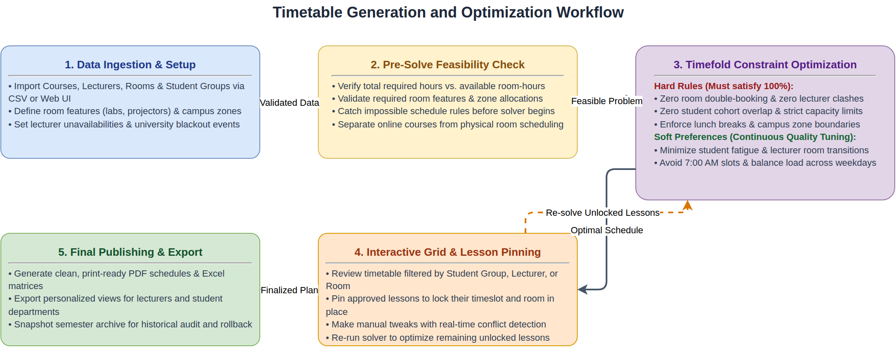
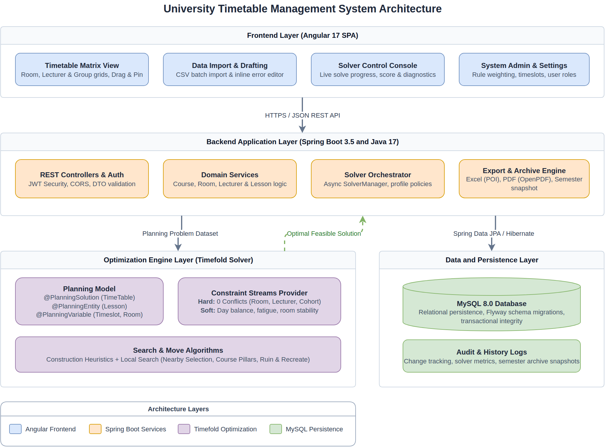

# University Auto-Timetabling System

An automated university timetable scheduling system built with Spring Boot, Timefold Solver, and Angular that generates conflict-free, balanced academic schedules.

[](https://github.com/abulimen/timetable-management-system)
[](https://openjdk.org/)
[](https://spring.io/projects/spring-boot)
[](https://timefold.ai/)
[](https://angular.io/)
[](https://www.mysql.com/)

---

## What is this?

Universities have to schedule hundreds of course lectures across available rooms, lecturers, student cohorts, and timeslots without creating double-bookings or unworkable schedules.

Doing this manually is tedious and prone to errors. A single change—such as a lecturer becoming unavailable on Mondays—can break dozens of previously working classes.

This system automates the entire process. It takes course requirements, room capacities, lecturer availability, and campus policies, then uses an intelligent optimization engine to generate conflict-free, balanced timetables in seconds.

---

## Why I built it

In most academic institutions, creating a semester timetable takes weeks of spreadsheet juggling and trial-and-error. When room renovations, lecturer schedule changes, or new course sections are introduced, administrators often have to start over.

I built this system to replace manual spreadsheet scheduling with an automated optimization engine. The goal was to build a tool that guarantees zero hard rule violations (like double-booked rooms or lecturer clashes) while giving administrators full control to inspect, adjust, and lock individual classes in place.

---

## How it works

The system follows a 5-step workflow from raw university data to a published timetable:

1. **Data Ingestion & Setup**: Administrators import or configure courses, lecturers, student groups, rooms with equipment tags, campus zones, and working timeslots.
2. **Pre-Solve Feasibility Check**: The system validates whether total required course hours can physically fit into available room capacity and schedules before running the optimization engine.
3. **Timefold Constraint Optimization**: The engine evaluates thousands of schedule arrangements, guaranteeing zero hard rule conflicts while actively tuning soft preferences like balanced daily loads and minimal room changes.
4. **Interactive Grid & Lesson Pinning**: Administrators view the generated timetable filtered by Student Group, Lecturer, or Room. Approved classes can be "pinned" to lock them in place, and manual changes highlight instant conflicts.
5. **Publishing & Export**: Once finalized, timetables are exported to print-ready PDF schedules, Excel matrices, or saved to a semester archive for historical audit.



---

## What I built

### Timetable Generation & Optimization
* **Timefold Optimization Engine**: Automated scheduling that assigns timeslots and rooms to classes based on configurable rules.
* **Pre-Solve Feasibility Validation**: Checks capacity limits, equipment availability, and hour totals to catch impossible schedules before solving.
* **Lesson Pinning & Partial Solving**: Lock specific approved lessons into place while allowing the solver to freely optimize the remaining unlocked classes.
* **Online Class Support**: Seamlessly schedule online courses without consuming physical room capacity.

### University Resource Management
* **Course & Curriculum Management**: Track lecture, tutorial, and lab hours, required room features (e.g. projectors, lab benches), and allowed campus zones.
* **Lecturer Availability & Blackouts**: Define specific days/hours when lecturers cannot teach, plus campus-wide blackout periods for university events.
* **Combined Multi-Group Lectures**: Support courses attended by multiple student groups simultaneously without duplicate resource bookings.
* **Room & Zone Management**: Organize rooms by capacity, physical features, and campus zones to prevent cross-campus transit friction.

### Data Ingestion & Drafting
* **Guided CSV Bulk Import**: Multi-step import wizard for courses, lecturers, rooms, and student cohorts with downloadable templates.
* **Inline Error & Draft Editor**: Interactive table editor to fix formatting errors or missing references before committing data to the database.
* **Conflict Resolution**: Highlights duplicate records and unmapped foreign references during data import.

### Visualization & Export
* **Multi-View Timetable Matrix**: Interactive grid with filtering by Student Group, Lecturer, or Room.
* **Export Engine**: Export publication-ready PDF documents (via OpenPDF) and structured Excel matrices (via Apache POI).
* **Semester Archives**: Snapshot and restore semester timetables with full audit logging of administrative changes.

---

## The interesting engineering problem

Creating a university timetable is like solving a massive puzzle with thousands of moving pieces.

With hundreds of classes, dozens of rooms, and thousands of students, the number of possible ways to arrange the schedule is practically endless.

The main difficulty is that **every decision affects another**:
* Moving one class to avoid a room clash can push a lecturer into a conflict elsewhere.
* Avoiding a lecturer conflict might give a student group four classes in a row without a lunch break.
* Combined classes (e.g. three engineering cohorts attending one shared physics lecture) must fit into a room large enough for all of them, avoid conflicts with every group's individual timetable, and count as a single teaching session for the lecturer.

### How Timefold solves this

Rather than guessing randomly or giving up on the first collision, **Timefold Solver** uses an intelligent search process that continuously tests and refines possible timetable arrangements.

The system evaluates every candidate timetable against two categories of rules:

#### Hard Constraints (Rules that must NEVER be broken)
* **Room Conflict**: No room can host two physical classes at the same time.
* **Lecturer Conflict**: No lecturer can teach two classes at the same time.
* **Student Group Conflict**: No student group can have two classes at the same time.
* **Room Capacity**: Student attendance must never exceed the room's seating capacity.
* **Room Equipment**: Courses requiring specific equipment (such as computer labs) are only placed in rooms that have them.
* **Zone Restrictions**: Classes are kept within allowed campus areas or buildings.
* **Lecturer Unavailability**: Classes are not scheduled when a lecturer is marked unavailable.
* **Lunch Break Protection**: Classes do not overlap the university's lunch hour.
* **Same Course Daily Limit**: A student group cannot have the same subject multiple times on the same day.
* **Operating Hours**: Classes must end within official daily university hours.
* **Special Events**: University-wide events block out affected rooms, lecturers, and student groups.

#### Soft Constraints (Preferences to improve schedule quality)
* **Room Capacity Fit**: Avoids placing small classes in giant auditoriums to prevent wasted space.
* **Student Fatigue**: Discourages long, unbroken chains of back-to-back lectures for students.
* **Lecturer Room Stability**: Minimizes how often lecturers have to switch rooms or buildings during the day.
* **Daily Load Balance**: Spreads a student group's classes evenly across the week instead of cramming them into one or two days.
* **Early Morning & Late Hours**: Discourages 7:00 AM and late evening classes when other times are available.
* **Lecturer Workload Limits**: Discourages exceeding maximum consecutive teaching hours for faculty members.

---

## Architecture



* **Frontend (Angular 17)**: A single-page web interface providing interactive timetable grids, CSV data import tools, and live solver progress monitoring.
* **Backend Application (Spring Boot 3.5 & Java 17)**: Manages REST APIs, user authentication, data validation, and asynchronous solver execution.
* **Optimization Engine (Timefold Solver)**: Runs in-process to evaluate scheduling rules and search for the best timetable arrangement.
* **Data & Storage (MySQL 8 & Flyway)**: Stores institutional data, audit logs, and semester archives with automated database migrations.

---

## Technology

| Technology | What it does |
|------------|--------------|
| **Java 17** | Core backend programming language |
| **Spring Boot 3.5** | REST API framework, security, and application management |
| **Timefold Solver 1.31** | Optimization engine for generating conflict-free timetables |
| **Angular 17** | Web frontend interface with interactive timetable views |
| **MySQL 8.0** | Relational database for storing schedules and system data |
| **Flyway** | Version-controlled database schema migrations |
| **Apache POI & OpenPDF** | Generation of formatted Excel matrices and print-ready PDF schedules |

---

## Challenges and lessons

* **Handling Combined Classes**: Some large courses combine students from several departments into one lecture hall. The system had to check schedule conflicts for every student group involved while booking only a single room and a single lecturer.
* **Prioritizing Must-Have Rules Over Nice-to-Haves**: A schedule with zero double-bookings is much more important than a schedule with ideal break times. Structuring the rules so the engine eliminates all conflicts first before polishing preferences was key to finding workable timetables quickly.
* **Letting Humans Make Adjustments**: Automatic scheduling shouldn't lock out administrators. Building a system where users can "pin" approved classes in place and let the system arrange the rest required careful state management so manual changes are never overwritten.

---

## Current limitations

* **Fixed Timeslot Grid**: The system operates on predefined hourly blocks (e.g. 1-hour or 2-hour slots) rather than arbitrary start times.
* **Single-User Solver Runs**: Timetable editing is locked while a schedule generation is actively running to prevent conflicting edits.
* **Impossible Schedules (Over-Constrained Data)**: If an institution requests more class hours than there are available rooms and time slots, the system cannot produce a conflict-free timetable. In those cases, administrators must add rooms/times or adjust their requirements.

---

## Running the project

### Prerequisites
* Java 17 or higher
* Maven 3.8+
* Node.js 18+ and npm
* MySQL 8.0+

### 1. Database Setup
Create the MySQL database:
```bash
mysql -u root -p -e "CREATE DATABASE timetable_db;"
```

### 2. Backend Configuration & Start
Configure database credentials in `src/main/resources/application.yml` (or via environment variables), then start the backend:
```bash
./mvnw spring-boot:run
```
The backend API will start at `http://localhost:8080/api/v1`.

### 3. Frontend Start
Install dependencies and run the Angular development server:
```bash
cd frontend
npm install
npm start
```
Open `http://localhost:4200` in your browser.

---

## Project status

Built as a functional university timetable automation system with a complete Spring Boot REST API, Timefold optimization engine, and Angular management interface. Available for demonstration and further development.

---

## About

Built by **Jonathan**, a Software Engineering student focused on building practical, scalable systems that solve complex real-world operational problems.

* **GitHub**: [github.com/abulimen](https://github.com/abulimen)
* **Project Repository**: [github.com/abulimen/timetable-management-system](https://github.com/abulimen/timetable-management-system)
